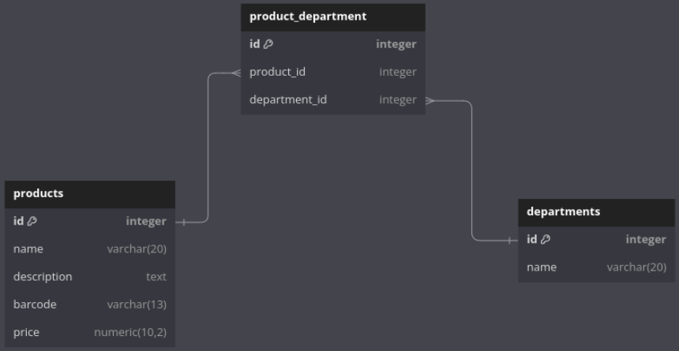

# Product and Department API Project

# Table of Contents:
 - [Overview](#overview) 
 - [Features](#features)
 - [Entity Relationship Diagram](#diagram)
 - [API Endpoints](#endpoints)

 

## Overview

This is an API project for managing products and their relationships with departments. The API is built with Node.js, Express.js, and TypeScript, using TypeORM to interact with the PostgreSQL database.

   

 

## Features
### Products Management:

- Create a new product with name, description, barcode, price and departments.
- Retrieve all products or a specific product by ID.
- Retrieve all products within the same department.
- Update product details.
- Delete a product.

### Departments Management:

- Create a new department with a name.
- Retrieve all departments or a specific department by ID.
- Update department details.
- Delete a department.

### Relationships:

- Products can be associated with one or more departments .
- Products: Represents the items managed by the API.

 

## Entity Relationship Diagram

 

### Many-to-Many Relationship Table
The relationship between Products and Departments is managed through a join table automatically created by TypeORM based on the Many-to-Many association in the entities. One product can be associated with one or more departments and one department can be associated with one or more products. 

 

## API Endpoints

### Products:

- POST /products: Create a new product.
- GET /products: Retrieve all products.
- GET /products/:id: Retrieve a product by ID.
- GET /departments/:departmentName/products: Retrieve all products within a department.
- PUT /products/:id: Update a product by ID.
- DELETE /products/:id: Delete a product by ID.

### Departments:

- POST /departments: Create a new department.
- GET /departments: Retrieve all departments.
- GET /departments/:id: Retrieve a department by ID.
- PUT /departments/:id: Update a department by ID.
- DELETE /departments/:id: Delete a department by ID.
